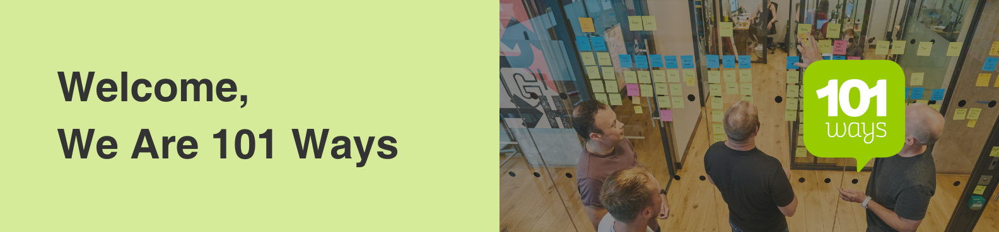
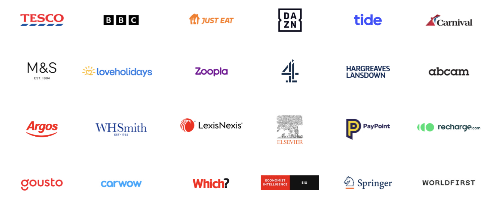

## Introduction 🤝

We help our clients create products and services that transform how people think, buy and behave. We have an organisation of over 150+ people and work with some of the largest brands in the Europe, such as M&S, Recharge, Tide Banking, Hargreaves Lansdown, Zoopla, Just Eat and many, many more.

## Engineering At 101Ways 💻
At 101 Ways we pride ourselves on delivering the highest quality work to our clients and uphold various standards. Infact we have embedded these into principles which we hope all of our engineers will follow:
[101 Ways Engineering Principles](https://docs.google.com/document/d/1H5n6TvZYD2q_YfN0CfI90tqega_T_KvfN8jZFBAzTNc/edit?usp=sharing)

We measure the success of our engineers on the following things:
- Delivery of work to the client (PRs & tickets closed).
- Instilling and upholding good ways of working.
- Collaborative behaviour with both 101 Ways engineers and client engineers (and stakeholders).
- Being a team player and indexing for quality (adding unit tests, E2E tests, AGILE methodology, DORA metrics, etc.).
- Balancing doing the right thing and the ideal thing, for example: if under a deadline we may not implement the most ideal system in place but one that in in-line with client budget and timescales).

## Some Of The Technologies We Use 🚀

### Languages

### Devops

### Database Tooling

### Frameworks

### General Tooling

